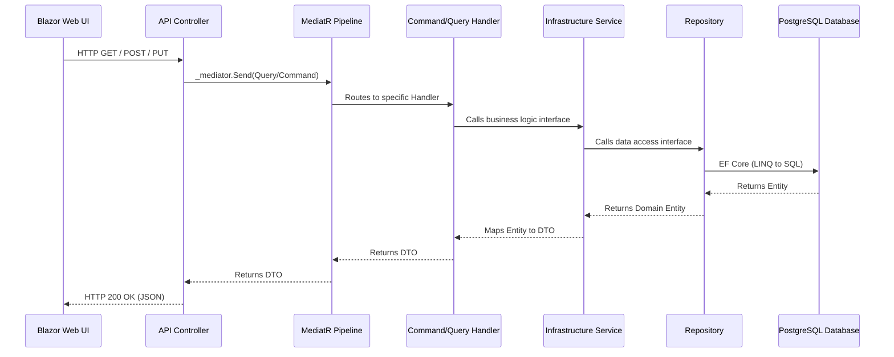

# Clean Architecture Code Flow (MediatR CQRS)

This document outlines the standard API request flow used in this project, ensuring a highly decoupled and scalable architecture. This exact flow is implemented in modules like `EmailTemplates` and `Categories`.

## High-Level Flow Diagram

## Step-by-Step Layer Breakdown

### 1. Presentation Layer (Blazor UI & API)
- **Blazor Component (`Categories.razor`)**: Triggers an action (e.g., clicking "Save").
- **Web Service (`CategoryService.cs`)**: Uses `IHttpClientFactory` to send an authenticated HTTP request to the API.
- **API Controller (`CategoriesController.cs`)**: Receives the HTTP request. **It contains no business logic or database access**. It simply packages the request into a MediatR object and sends it.

> [!TIP]
> The Controller is "Thin". It only knows about HTTP status codes and routes.

### 2. Application Layer (CQRS & MediatR)
- **Commands & Queries (`CategoryCommands.cs` / `CategoryQueries.cs`)**: These are simple Data Transfer Objects representing the user's intent.
  - *Query*: Request to read data (e.g., `GetCategoriesQuery`).
  - *Command*: Request to mutate data (e.g., `CreateCategoryCommand`).
- **Handlers**: MediatR automatically finds the correct `IRequestHandler` for the incoming Command/Query. The handler executes the logic, usually by delegating to a dedicated Application Service.

### 3. Infrastructure Layer (Services & Repositories)
- **Application Service (`CategoryService.cs` in Infrastructure)**: Implements business logic (e.g., checking if a category name already exists, calculating defaults). It implements an interface defined in the Application layer (`ICategoryService`), adhering to the Dependency Inversion Principle.
- **Repository (`CategoryRepository.cs`)**: Encapsulates all Entity Framework Core logic. It is the *only* place where `ApplicationDbContext` is injected.

> [!IMPORTANT]
> The Repository is responsible for `Add()`, `Update()`, `Get()`. However, calling `SaveChangesAsync()` is usually handled by the `IUnitOfWork` inside the App Service, ensuring multiple repository operations happen in a single SQL transaction.

### 4. Database Layer
- **PostgreSQL**: Stores the actual data.

## Why use this complex flow?
1. **Decoupling**: The API doesn't care how data is saved. You could swap PostgreSQL for MongoDB by only changing the Repository layer.
2. **Testability**: You can easily unit test the Handlers and App Services without spinning up a real database by mocking the `ICategoryService` or `ICategoryRepository` interfaces.
3. **Single Responsibility**: Every file has exactly one reason to change. Controllers handle HTTP, Handlers manage workflow, Services handle business rules, and Repositories handle SQL.
