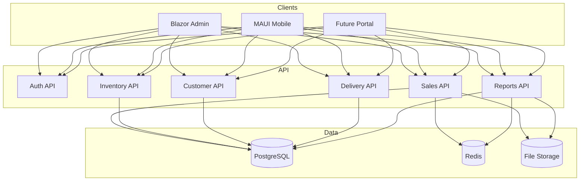
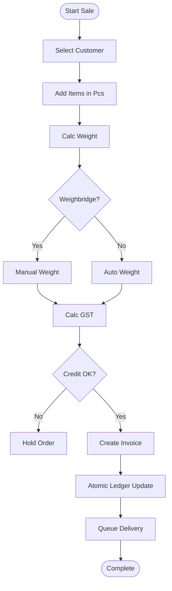

# Vikash Iron & Steel ERP — Master Architecture & Implementation Plan

Unified blueprint merging product requirements and technical design for **Vikash Iron And Steel**.

---

## 1. Technology Stack

| Layer | Technology |
|-------|------------|
| Backend API | ASP.NET Core Web API — Clean Architecture, MediatR CQRS |
| Admin Panel | Blazor Web App (Interactive Server) — `VikashERP.Web` |
| Mobile App | .NET MAUI — `mobile-app/` |
| Database | PostgreSQL |
| Cache | Redis (dashboard KPIs, low-stock lookups) |
| File Storage | PDF invoices, delivery challans |
| Auth | JWT (API) + Cookie session (Blazor) |

### Current Workspace Layout

```text
VikashIronx/
├── backend/
│   ├── VikashERP.Domain/
│   ├── VikashERP.Application/
│   ├── VikashERP.Infrastructure/
│   ├── VikashERP.SharedKernel/
│   └── VikashERP.API/
├── VikashERP.Web/              # Blazor admin panel
├── mobile-app/                 # MAUI app
├── database/
│   └── database_schema.sql     # Full PostgreSQL schema
└── docs/
    └── architecture_documentation.md
```

---

## 2. Core Modules

### 2.1 Customer Management
- **Auto-generated account number (AC No)** — unique system ID per customer for repository, ledger, and billing lookup
- Customer master, ledger, due tracking
- Payment history, credit limits
- Order history, customer-wise reports

#### Customer Account Number (AC No)

Every customer receives a **system-generated account number** when created. This is the primary business identifier used across the customer repository, ledger, invoices, payments, and reports.

| Rule | Detail |
|------|--------|
| Generation | Auto-assigned on customer create — not entered manually |
| Uniqueness | Must be unique across all customers |
| Immutability | Cannot be changed after creation |
| Format | `CUS-{YYYY}-{SEQ}` — e.g. `CUS-2026-000001` |
| Usage | Search, ledger statements, invoices, challans, due reports, payment receipts |

**Repository fields (customer master):**

| Field | Description |
|-------|-------------|
| `account_number` | Generated AC No (unique, indexed) |
| `name` | Customer / contact name |
| `company_name` | Business name (optional) |
| `phone`, `email`, `gstin`, `address` | Contact & tax details |
| `credit_limit`, `current_balance` | Credit & running balance |

**Generation logic (application layer):**

```text
On CreateCustomer:
  1. Read current year (e.g. 2026)
  2. Get next sequence for prefix CUS-{YYYY}-
  3. Assign account_number = CUS-2026-000001 (zero-padded 6 digits)
  4. Persist customer — reject if duplicate (retry with next seq)
```

AC No appears on: customer list, profile page, invoice header, ledger PDF, payment entry, and mobile app customer search.

### 2.2 Inventory / Stock
- Live stock, multi-unit (Pcs + KG)
- Multi-godown stock, low-stock alerts
- Purchase entry, stock movement, adjustments
- Cutting loss & scrap handling

### 2.3 Billing / Sales
- GST invoice, challan, quotation, sale order
- Partial/advance payment, multiple payment modes
- Auto due calculation, weighbridge override

### 2.4 Delivery Management
- Dispatch, driver & vehicle assignment
- Delivery status, challan, transport charges
- Pending delivery tracking

### 2.5 Staff Management
- Attendance, salary, roles & permissions
- Activity tracking, shift timing

### 2.6 Reports & Analytics
- Daily/monthly sales, profit, stock reports
- Pending payments, GST reports, top products
- Excel/PDF export, dashboard analytics

### 2.7 Online System
- Cloud PostgreSQL, real-time sync
- Multi-device (Blazor + MAUI)
- Future customer self-service portal

---

## 3. Enterprise Architecture

```text
Client Layer
├── Blazor Admin Panel (VikashERP.Web)
├── MAUI Mobile App
└── Future Customer Portal

API Layer (VikashERP.API)
├── Auth          ├── Sales & Billing
├── Inventory     ├── Customers & Ledger
├── Delivery      ├── Reports
└── Staff         └── Payments

Business Layer (VikashERP.Application)
├── Domain Logic & Validation
├── Calculation Engine (Pcs → KG, GST)
└── Ledger Engine (atomic transactions)

Data Layer
├── PostgreSQL (EF Core)
├── Redis Cache
└── File Storage (PDFs)
```

### Data Flow (Level-1)



---

## 4. Ledger-Based Design

Every financial and stock action writes an immutable history row — never overwrite balances directly.

| Action | Ledger |
|--------|--------|
| Sale / Invoice | `customer_ledger` (debit) + `stock_ledger` (deduct) |
| Payment received | `customer_ledger` (credit) |
| Stock purchase | `stock_ledger` (add) + `supplier_ledger` |
| Delivery completed | `deliveries` status log |

**Benefits:** Accurate reports, full audit trail, no balance mismatch.

---

## 5. Product Hierarchy

```text
Category
 └── Product
      └── Variant (size + thickness)
           ├── unit_pcs_to_kg   (conversion factor)
           └── alert_qty_pcs    (low stock threshold)
```

Example: `Pipe → GI Pipe → 1 inch → 2mm`

---

## 6. Business Rules & Calculation Engine

### Weight (Pcs → KG)
$$\text{Weight (KG)} = \text{Qty (Pcs)} \times \text{unit\_pcs\_to\_kg}$$

### Weighbridge Override
Manual scale weight can replace auto-calculated weight; difference stored on invoice item for audit.

### GST (18% steel category)
- **Intrastate:** CGST 9% + SGST 9%
- **Interstate:** IGST 18%

### Credit Guard
$$\text{Projected Balance} = \text{Current Balance} - (\text{Invoice Total} - \text{Advance Paid})$$

Block sale if projected balance exceeds credit limit (unless admin override).

### Billing Flow



---

## 7. Database Schema

Full SQL: [`database/database_schema.sql`](../database/database_schema.sql)

| Group | Tables |
|-------|--------|
| Masters | `godowns`, `suppliers`, `customers` *(incl. `account_number`)*, `categories`, `products`, `product_variants` |
| Ledgers | `customer_ledger`, `supplier_ledger`, `stock_ledger` |
| Sales | `invoices`, `invoice_items` |
| Delivery | `deliveries` |
| Staff | `staff`, `attendance`, `staff_salaries` |
| Auth | `Users`, `PasswordResetTokens` (EF Core) |

---

## 8. Dashboard UI (Target)

**KPI cards:** Today Sale · Pending Amount · Low Stock · Delivery Pending

**Charts:** Monthly sales · Customer dues · Top products

**Live feed:** Latest invoices · Pending deliveries · Recent payments

Nav shell exists in `VikashERP.Web` — pages are placeholders pending module build.

---

## 9. Access Roles

| Role | Access |
|------|--------|
| Super Admin / Owner | Full dashboard, reports, settings |
| Back Office / Staff | Billing, stock adjustments |
| Manager | Operations + limited reports |
| Employee / Driver / Loader | Delivery check-offs, mobile tasks |
| Customer | Future portal — orders, ledger, payments |

---

## 10. Integrations (Planned)

| Feature | Status |
|---------|--------|
| JWT + Refresh tokens | Implemented |
| SendGrid email (password reset) | Implemented |
| WhatsApp alerts | Planned |
| UPI QR on invoices | Planned |
| E-invoice / E-way bill | Planned (model placeholders) |
| Barcode scanner | Future |
| Redis caching | Planned |
| Offline MAUI sync | Future |

---

## 11. Open Questions

- E-invoice & E-way bill mandatory from day one?
- Barcode/QR on products vs invoice-only QR?
- Purchase module scope (supplier PO, purchase dues)?
- Which mobile roles ship in v1 (Owner only vs Staff + Driver)?
- Multi-branch vs single-branch for initial release?

---

## 12. Implementation Status (Current)

| Area | Status |
|------|--------|
| Solution structure (API + Web + MAUI) | Done |
| Auth (login, refresh, forgot/reset password) | Done |
| PostgreSQL schema design | Done (SQL file) |
| EF Core entities (Users only) | Partial |
| Customer / Inventory / Billing / Delivery | Not started |
| Ledger engine | Not started |
| Dashboard KPIs | Shell only |
| MAUI features | Template only |
| Redis | Not started |

---

## 13. Phased Implementation Roadmap

### Phase 0 — Foundation (current → next)
- [x] Clean Architecture solution
- [x] Auth (API + Blazor cookie session)
- [ ] EF migrations for all core tables
- [ ] Seed super-admin + sample masters
- [ ] Global API authorization on all controllers
- [ ] Move secrets to User Secrets / env vars

### Phase 1 — Masters & Customers
- [ ] Godowns, categories, products, variants CRUD
- [ ] Customer master CRUD with **auto-generated AC No** (`CUS-{YYYY}-{SEQ}`)
- [ ] Customer ledger read API
- [ ] Blazor: Entity Profiles, Material Catalog pages

### Phase 2 — Inventory Engine
- [ ] Stock ledger write service (purchase, adjustment, transfer)
- [ ] Live stock query per variant/godown
- [ ] Low-stock alerts
- [ ] Blazor: Inventory Pulse page

### Phase 3 — Billing (core value)
- [ ] Calculation engine (Pcs→Kg, GST, credit check)
- [ ] Create invoice command (atomic: invoice + customer ledger + stock ledger)
- [ ] Invoice PDF generation
- [ ] Blazor: Generate Invoice page

### Phase 4 — Delivery & Payments
- [ ] Delivery dispatch, challan, status workflow
- [ ] Payment entry against invoice
- [ ] Blazor: Transport / dispatch UI

### Phase 5 — Reports & Dashboard
- [ ] KPI queries + Redis cache
- [ ] Daily revenue audit, trade ledger reports
- [ ] Dashboard charts (MudBlazor)
- [ ] Excel/PDF export

### Phase 6 — Staff & Mobile
- [ ] Staff, attendance, salary modules
- [ ] MAUI: owner dashboard, delivery check-off
- [ ] Role-based nav enforcement

### Phase 7 — Integrations & Future
- [ ] WhatsApp notifications
- [ ] UPI QR on invoices
- [ ] E-invoice API
- [ ] Customer portal
- [ ] Multi-branch support

---

## 14. Suggested Module → API Mapping

| Blazor Route | API Feature Folder | Priority |
|--------------|-------------------|----------|
| `/` (Dashboard) | `Features/Reports` | Phase 5 |
| `/invoice` | `Features/Invoices` | Phase 3 |
| `/ledger` | `Features/Customers` | Phase 1 |
| `/audit` | `Features/Reports` | Phase 5 |
| `/material-catalog` | `Features/Products` | Phase 1 |
| `/inventory-pulse` | `Features/Stock` | Phase 2 |
| `/profiles` | `Features/Customers` | Phase 1 |
| `/admin/staff` | `Features/Staff` | Phase 6 |

---

## 15. Future Scope

- AI sales & inventory analytics
- WhatsApp invoice delivery & payment reminders
- Barcode integration
- Multi-branch / multi-godown expansion
- Customer self-service portal
- Offline sync for MAUI field users

---

*Last updated: June 2026 — reflects merged product spec + technical architecture aligned with the VikashIronx workspace.*
